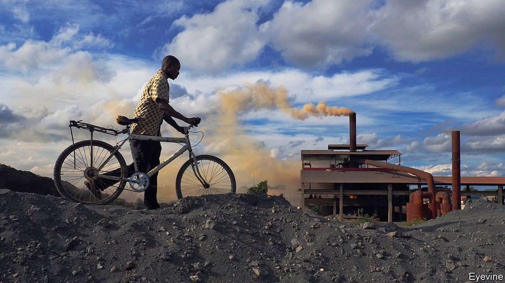
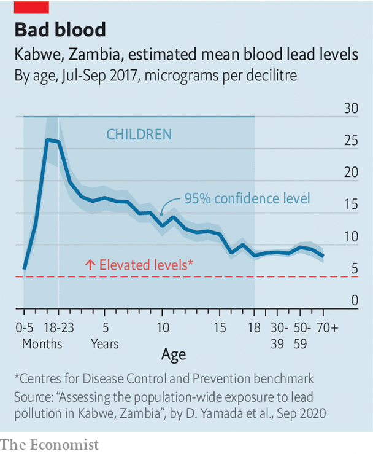

###### Toxic legacies

# How a lead mine in Zambia has blighted a town 

##### Children are being poisoned. A lawsuit tries to apportion blame 

 

> Dec 10th 2020 


AZAEL TEMBO takes a seat in the shade of a mango tree outside his house. He kicks up the dust. “It’s affected,” he says, pointing to the plume around his feet. The 67-year-old lives in Kabwe, a town in central Zambia whose history, like that of much of the southern African country, is intertwined with mining. Kabwe sprung up around a mine founded in 1904 by the Rhodesian Broken Hill Development Company, a British colonial firm. For decades miners like Mr Tembo crushed and burnt ore to extract lead. That metal made Kabwe but it also devastated it. To this day lead particles blow across town, making their way into houses and bloodstreams.


Scientists generally consider soil hazardous if it has more than 400mg of lead per kilogram. In three townships near the old mine the soil contains six, eight and 15 times that amount, according to analysis in 2014 by Pure Earth, an environmental NGO. “Kabwe is the most toxic place I’ve ever been to,” says Richard Fuller, its president.


Prolonged exposure to lead degrades the body’s nervous and circulatory systems, damaging the brain and other organs. It is associated with higher rates of miscarriage, convulsions, comas and death. Mr Tembo believes his poor eyesight and sore limbs are from lead poisoning.


But his main concern is for his four grandchildren, in particular the two-year-old. She enjoys playing outside and is puckishly recalcitrant when told to stop putting things in her mouth. “I tell her mum to not let her eat the soil, but kids do what they will do,” he says. Children are more likely to inhale and ingest toxic dust. Their bodies are more susceptible to its potential effects, such as behavioural problems, learning disabilities and lower IQs.


Three-quarters of Kabwe’s population are estimated to have more than five micrograms of lead per decilitre in their blood, levels scientists consider elevated. Among children the average levels are much higher (see chart). “Kabwe is the most polluted place for children on the planet,” says Jack Caravanos of the NYU School of Global Public Health.

 


The pollution in Kabwe is a scandal. Yet responsibility for it has long been contested, and that is set to continue. In October Mbuyisa Moleele Attorneys, a South African law firm, with help from Leigh Day, a British one, announced a class-action lawsuit against a subsidiary of Anglo American on behalf of potentially more than 100,000 children and women of reproductive age in Kabwe. It is targeting Anglo because it was affiliated to the mine from the 1920s until shortly after Zambia’s mines were nationalised in 1970.


The suit claims that most of the pollution stems from the period when the mine was under the de facto control of Anglo, which allegedly did not do enough to stop the harm. Anglo rejects the claims, arguing that its involvement ended five decades ago and that, before then, it was neither the operator nor a majority shareholder in the mine and thus not responsible.


The case may take years. The lawyers for the plaintiffs must first convince a South African court to take it on. Only then may it proceed to a trial. Meanwhile children in Kabwe will keep on playing in the dust.


There have been attempts to make Kabwe less dangerous. The first concerted efforts came in the 1990s, when Zambia’s state-owned mining company conducted blood testing and provided some topsoil to cover toxic yards. But these efforts were woefully inadequate; according to Mr Fuller of Pure Earth, the government also claimed that sick residents had malaria and prescribed milk to children.


After cajoling from Mr Fuller, the World Bank included Kabwe in a broader project it funded to clean up Zambian mines. (To get Zambian officials on board, the Bank’s representative had them watch “Erin Brockovich”, a film in which Julia Roberts plays a lawyer representing victims of pollution.) The scheme, which ran from 2003-11, had some successes. It dredged a toxic canal and buried some contaminated soil. But it did not treat the main source of the dust—the former mine and dumps—and it left roads unpaved and most houses untreated. Cornelius Katiti, a local councillor at the time, reckons that just 10% of houses had topsoil replaced. An independent evaluation of the project commissioned by the World Bank found various shortcomings.


Another clean-up funded by the bank was started in December 2016. But it, too, is struggling. Some children have been tested and have received therapy to reduce blood lead levels. But since little has been done about the lead in the environment there is a risk their levels will rise again. “If this were in London, Johannesburg or a rich suburb of Lusaka it would not happen like this,” says Juliane Kippenberg of Human Rights Watch, an international NGO.


At the project office in Kabwe officials refuse to talk to your correspondent. When asked if nothing has been done to remediate the area, one worker replies: “It depends on your definition of nothing.” Later, in the capital, Lusaka, the director of the project, Gideon Ndalama, concedes that it has had a “slow start”, arguing that there is not enough money to do a full job.


More than 25 years after the mine closed, its huge waste dump—known as Black Mountain—looms. Artisanal miners cart away maize sacks filled with rocks.


In the absence of a clear plan that will end contamination in Kabwe, residents are trying to protect themselves as best they can. Local NGOs such as Environment Africa are educating people in schools and on radio shows. Families pass on warnings. “I don’t let my younger brothers play outside,” says Joy Mbuzi, a 19-year-old student, whose grandfather, a former miner, drummed into her the dangers of lead. “I’m worried about their IQs,” she says.


In his front yard Mr Tembo introduces his son, Richard. “All these years I’ve been affected,” says the 20-year-old. He struggles to focus on his college work and suffers from memory loss. He worries about his younger nieces and their difficulties at school. Given all this, hasn’t his father considered leaving Kabwe? He doesn’t have the money, says Mr Tembo. “This is our home. We’ve nowhere else to go.” ■

