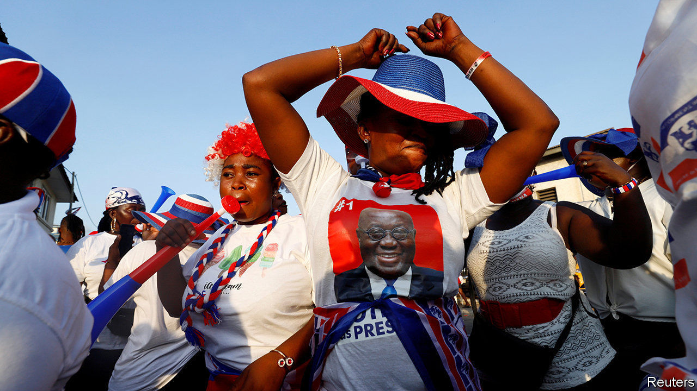

###### Skirt and blouse

# Nana Akufo-Addo wins a second presidential term in Ghana 

##### But his party takes a hit in parliament 

 

> Dec 10th 2020 


AFTER A PRAYER, the electoral commission announced that Ghana’s president, Nana Akufo-Addo, had won another four years in office in national elections held on December 7th. His supporters cheered in the streets. But his victory is far from comprehensive.


Mr Akufo-Addo’s margin shrank and his party suffered heavy losses in the parliament. About 30 seats were flipped, leaving the house split almost evenly between the two major parties. (As The Economist went to a press a handful were still in the balance.) The main opposition candidate and former president, John Mahama, was yet to concede. His party rejected the result, alleging irregularities without providing evidence of any. Few expect it to challenge the results in the streets, even if it does take them to court. Yet the moment the dust has settled, Ghana will face tough economic choices. Its public debt, already high, is climbing fast. Dealing with it may be even harder if, as remains possible, power is split between the executive president and an opposition-controlled parliament.


Mr Akufo-Addo’s win owes plenty to his government’s popular decision in 2017 to make senior high school education free. Voters also backed his handling of covid-19, which included generous handouts. Pre-election surveys showed he was trusted for his management of the economy.


Set against this, though, is the view among many voters that his government has failed at reducing corruption, says Emmanuel Gyimah-Boadi of Afrobarometer, a pan-African research group. Shortly before the election the independent special prosecutor for corruption, Martin Amidu, resigned citing political interference. Voters, especially in the capital, Accra, were unimpressed, swinging their support from the president to his opponent. The swing might have been wider still, had Mr Mahama not been tainted by corruption scandals from his time in office.


Voters seemingly punished ruling-party MPs by voting against them while still supporting the president’s bid. This was because they are seen as having failed to build things like roads or clinics in their constituencies, says Bright Simons of Imani, a local think-tank. In about 20 constituencies the opposition’s parliamentary candidate won office, even as their leader lost the presidential vote.


“Skirt-and-blouse” voting, as such splits are called in Ghana, suggests that voters are discerning in their exercise of democratic power. This may be because of experience: Ghana has held elections since 1992, with power regularly changing hands. That has made it a beacon in the region.


Yet Ghana’s democracy is not without troubles. More than 62,000 soldiers and police officers were deployed. Even so, five people were killed on election day and the day after. Political violence has been rising since 2012 and the number of Ghanaians who say they fear becoming victims of it increased by eight percentage points to 43% between 2014 and 2018.


Elections also usually add to the country’s economic woes. Those in power in Ghana almost always splurge heavily in the year before voters get to make their choice. This is often followed by an IMF bail-out; Ghana finished its 16th in 2019. Perhaps trying to tie itself to the mast, the New Patriotic Party (NPP) government introduced a rule in 2018 limiting budget deficits to 5% of GDP. But the IMF forecasts a deficit of 16.4% for 2020, the highest in sub-Saharan Africa. Covid-19 explains some of this. But the limit would have been exceeded anyway, says Henry Telli, a Ghana-based economist for the International Growth Centre of the London School of Economics.


Worse, Ghana was already at high risk of debt distress before covid-19 hit. It spends and borrows like a middle-income country, but does not collect revenue like one, says Greg Smith of M&amp;G, an asset manager. It scrapes together tax revenue of about 14% of GDP, which is low even for similar African countries. For the next few years Ghana is likely to spend half of its revenue on interest payments. There are other troubles, too. A big new offshore oilfield, Pecan, was expected to boost growth. But this has been delayed amid lower oil prices.


Mr Akufo-Addo made bold promises on the campaign trail, from building more than a hundred hospitals to adding railway lines. If he wants parliament to pass his budgets, he may have to agree to pork-barrel side-deals with MPs. Yet if the new government cannot set a credible plan to cut spending—and stick to it— it will lose credibility with lenders. And that, says Mr Telli, could see the IMF back again. ■

