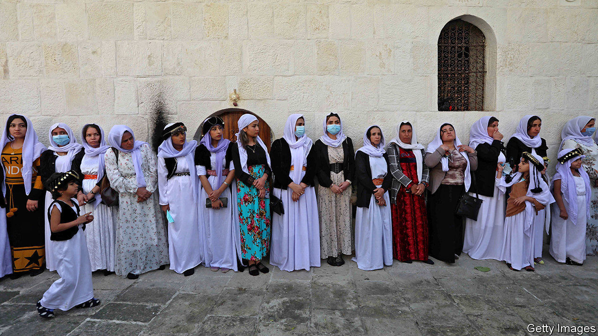
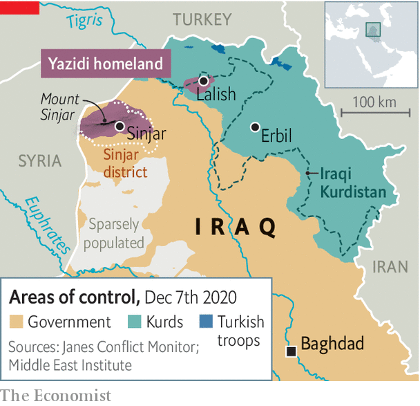

###### Divided, oppressed and abandoned

# The Yazidis are still struggling to survive 

##### Escaping Islamic State was just the beginning 

 

> Dec 10th 2020 


LIKE A PICTURE of purity in white robes, white shoes and a white turban, Ali Iliyas emerged from a candle-lit sanctum. He had just been inaugurated as the new Baba Sheikh, or spiritual leader of the Yazidis, on November 18th. Believers gathered at Lalish, a temple in Iraqi Kurdistan, banging drums and tootling flutes to celebrate.


But behind the scenes an unholy row is blazing between Yazidi leaders. The Asayish, or Kurdish police, had to intervene after scuffles broke out at a gathering to announce the new leader. Many Yazidi elders boycotted the temple ceremony. For the first time in its history, the esoteric Yazidi religion faces a schism.


Six years ago Western armies saved the Yazidis from Islamic State (IS). The jihadists killed 5,000 of their men and enslaved 5,000-7,000 of their women, mostly to rape. The genocide caused many Yazidis, who number perhaps 1m, to flee abroad. Inside Iraq new pressures are tearing the group apart.


Some Yazidis see themselves as part of the larger Kurdish community and have aligned themselves with the Kurdistan Democratic Party (KDP), which rules Kurdistan. But others blame the KDP for not stopping IS. They objected when Mir Hazim Tahsin Beg, a former KDP parliamentarian, was chosen as head of the Yazidis’ spiritual council last year, believing he does the party’s bidding. Nevertheless, it was Mir Hazim who chose the Baba Sheikh.


Many of the disgruntled Yazidis hail from Sinjar, home to a mountain the Yazidis consider holy (see map). Shia militias, the Iraqi army and the Kurdistan Workers’ Party (PKK), which fights for Kurdish self-rule inside Turkey, hold sway in the area—not the KDP. A number of Yazidis went to Baghdad in October to meet the prime minister and to protest against Mir Hazim. “He rules like a dictator,” says one of them. Elders within this faction are trying to set up a more representative authority.

 


Many Muslims consider Yazidis to be devil-worshippers. The peacock etched on their buildings represents Lucifer, the angel cast from heaven—though in the Yazidi telling he is Malik Taous and has been restored to grace. In the summer Turkey, the region’s most powerful Sunni state, bombed Sinjar, claiming the Yazidis had teamed up with the PKK, which Turkey considers a terrorist group. In the Turkish-held province of Afrin in Syria, militants have driven Yazidis from their homes and defaced their shrines.


About 40% of Yazidis are thought to have fled to the West. Isolated and cut off from their homeland, many lose their religion. Yazidi elders oppose writing oral traditions down or putting them online. Meanwhile, they rigidly uphold a ban on marrying out. Some children born of Yazidi women raped by IS members are put out of the flock. Other strictures—such as the insistence on marrying inside the Yazidis’ caste system—are impractical among tiny communities abroad. Falling short, many give up altogether. It is common to see Yazidis abroad wearing blue clothes, which is taboo back home.


A little bit of liberalism could solve a lot of these problems. The opponents of Mir Hazim might be satisfied if he accepted a broader and more consultative council. Yazidi elders could ease up on those rules that are all but impossible to follow—and they could start writing things down. Many Yazidis want other countries to help rebuild Sinjar and guarantee their protection. But they are not holding their breath. They cite 74 massacres in their history—and expect to keep counting. ■

