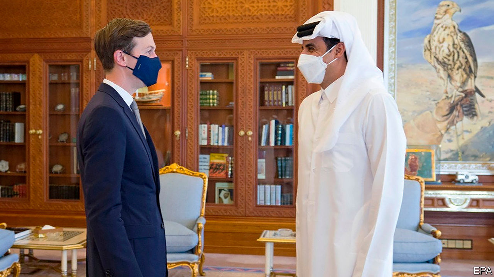
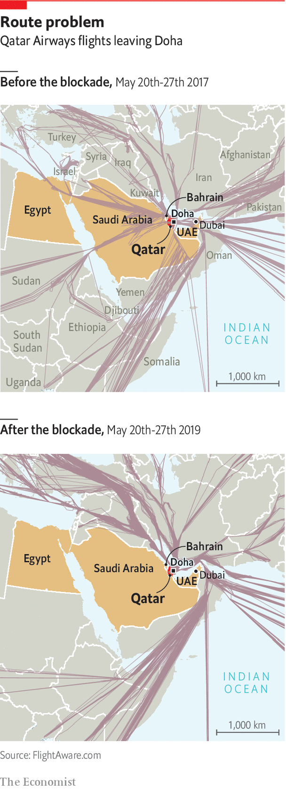

###### Bridging the Gulf

# The feuding Gulf states are trying to make nice 

##### But a real end to their dispute remains far off 

 

> Dec 12th 2020 


MONTHS AFTER four Arab states imposed an embargo on Qatar in 2017, a minister from the emirate made what he thought was a controversial comparison. “To be honest, we consider ourselves like Israel,” he said, referring to another small country isolated in the region. Improbably, almost three years later, this comparison seems too favourable to Qatar. Thousands of Israelis are visiting Dubai for the first time this December, while Qataris are nowhere to be found. Israel will soon have ambassadors to two of the six members of the Gulf Co-operation Council (GCC), the same number as Qatar—a GCC member.


The feud in the Gulf has long seemed intractable. But for the umpteenth time foreign officials are trying to resolve it. Jared Kushner, Donald Trump’s son-in-law and adviser (pictured, in blue mask), recently visited Saudi Arabia and Qatar to push for a deal. The Saudi foreign minister later said one was “within reach”. Qatari officials made encouraging noises too. Yet even if they promise to bury the hatchet, real reconciliation will remain out of reach.


In 2017 the “Arab quartet” behind the blockade—Bahrain, Egypt, Saudi Arabia and the United Arab Emirates (UAE)—served Qatar a list of 13 demands, among them closing Al Jazeera, the satellite broadcaster; cutting ties with Islamist groups such as the Muslim Brotherhood; and shutting a Turkish military base in Doha, Qatar’s capital. Qatar acceded to none of them and sometimes did the opposite, escalating its media war with the blockading states and deepening ties with Turkey.

 


American officials want the quartet to start by reopening their air space. That would fix a self-defeating facet of the embargo. The blockading states want Qatar to cut ties with Iran, yet by forcing dozens of Qatari planes to fly new routes over Iran each day they gifted it hundreds of millions of dollars in overflight fees. Reopening the air space would be progress, but hardly a reconciliation.


Mr Kushner, who will be out of a job next month, did not offer much to accelerate a deal. Nor is it clear what Qatar would offer the quartet in return. Buoyed by the world’s third-largest proven natural-gas reserves, its economy grew in 2017 and 2018 despite the embargo. It feels no pressure to make big concessions. A small one would be to quieten Al Jazeera, where the tone of the Arabic-language channel is often a bellwether for relations between Qatar and its neighbours. Beyond that, Qatar may offer the promise of a less antagonistic relationship. In other words, not much.


That might still appease Saudi Arabia. The blockade has upset America, a close partner of both Qatar and the quartet. Steps to end the dispute would curry favour with the incoming Biden administration. Some of Saudi Arabia’s partners are less conciliatory, though. Qatar remains a bugbear for Egypt because of its support for the Muslim Brotherhood. Less enthusiastic still is the UAE, whose hostility towards political Islam puts it implacably at odds with Qatar. It has responded tepidly to the diplomacy.


Reconciliation between Saudi Arabia and Qatar would add to a growing list of disagreements between Saudi Arabia and the UAE. The Emiratis pulled out most of their troops from Yemen in 2019 and withdrew from the Saudi-led war there. They have grown nervous about Mr Trump’s belligerent policy towards Iran, which the Saudis have encouraged. Recently they have split over oil: the UAE is frustrated with Saudi-backed production caps imposed on members of the Organisation of the Petroleum Exporting Countries.


Diplomatic niceties will not end the discord between the Qatari emir (pictured, in white) and the leaders of Saudi Arabia and the UAE. And for all the talk of the “brotherly” Gulf states, the blockade has introduced a level of personal animosity in the region, particularly between Qataris and Emiratis. “People had a big shock that disturbed and tortured the social fabric of our region,” says a Qatari official. “To go back to normal, I think we need two or three generations.” Even if Qataris can soon fly over Dubai, they may not be eager to land. ■

