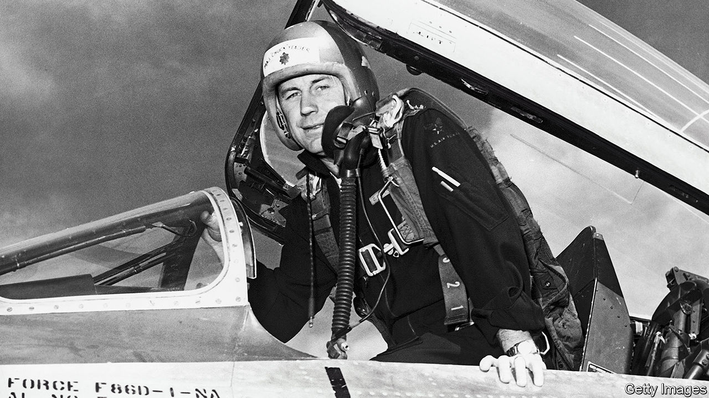

###### Mechanic to hero

# Chuck Yeager died on December 7th 

##### The flying ace and first to break the sound barrier was 97 

 

> Dec 12th 2020 


IF A FLOCK of grouse flew across his path when he was out hunting, Chuck Yeager knew what would happen. He would get his slingshot, pick up some stones, and let fly. With his 20/10 vision in both eyes, he could see to infinity; in five minutes two or three grouse would be dead, hit square in the head. When challenged to target-shoot at a paper plate nailed to a tree, he could aim to hit the nail. He had practised those skills in the woods of West Virginia until they were second nature.


In the second world war, flying over France in P-51s, he once more saw his prey from a long way off and stayed up-sun, so the Germans wouldn’t spot him. Then he shifted to be down-sun, behind them. Once he picked off five Me109s in a day, getting into a big old hairy dogfight, buzzing, diving, shooting, lots of high-gs, becoming an ace right there. He knew how his plane should behave, how all the hardware worked, how the ejector seat and parachute would save him: knew it as a mechanic, which was his training. Armed with that knowledge, nothing much could surprise him. He was in firm control of what was right around him, and what he couldn’t control, such as the enemy, or the outcome, or death, was not worth worrying about. He was too busy.


But when on October 14th 1947 he was dropped in the Bell X-1, a rocket-powered experimental plane, from the bomb bay of a B-29, he had no idea what lay ahead. Fun, probably, as he loved the X-1, and in his post-war test-pilot job he preferred tactical flying that focused on one aircraft, rather than a dozen different planes every week. It was more like combat, and the band of pilots he now belonged to, at Muroc air force base in California, were ex-warriors who felt the same way. “Glamorous Glennis” was painted on the bright orange fuselage in tribute to his wife—the wife with whom he’d had a horseback race two nights before, busting a couple of ribs when his horse flipped him, which still hurt like hell.


The engineers back at base feared that breaching the sound barrier might rip the aircraft apart. The least he expected was something like a bump in the road, to show he’d done it: strong proof for the friendly rivals back at base. Instead, at around 700mph (1,126kph) he felt nothing particular, just a bit of resistance, like poking his finger through Jell-O. He got the Collier trophy for it, a nice statuette on a plinth, and the family went to the White House to collect it (his father, a staunch Republican, refused to shake Harry Truman’s hand). But it was quite a let-down.


He had to go much faster to get the effects he had been half-anticipating. That happened in December 1953, after a few flights approaching Mach 2, twice the speed of sound. He was warned that if he went any faster his X-1A aircraft might “go divergent”. It did. At 74,700 feet (22,800 metres), and at 2.44 Mach speed, it began to roll uncontrollably, then spin upside down. Completely disoriented, battered by plus and minus g-loads, he remembered his helmet cracking the inner canopy, and not a lot else. At last the plane got upright and, at 25,000 feet, he popped it out of the spin. He had dropped 50,000 feet in 70 seconds. Back in radio contact, he gasped out: “Christ!…Boy, I’m not doing that any more.”


It was odd enough that he was in the air anyway. As a boy, running the hills or sitting with his grandfather learning to fish, he never got near a plane, except to see one in the sky. He had no ambitions that way and, with only high school behind him, not enough education. He enlisted in the air force in 1941 as a mechanic, earthbound and easy, because he had already tinkered for years with engines, water-pumps and his father’s cable tools for drilling for natural gas. He took up flight training mostly because pilots had beautiful girls on their arms, and hands that weren’t dirty. But he became the most decorated pilot in America.


In the same strange sort of reversal, he started out with no interest in space and ended up training astronauts. In the 1950s, when space was mentioned, he would dismiss it as a place where he wouldn’t be flying, but sitting in a thing controlled by someone else. No doubt the views were pretty, but he couldn’t have cared less. And anyway, he had no degree. His ideas changed as the government began to press the space programme and America, in his view, fell far behind the Soviets in developing space technology. The USAF Aerospace Research Pilot School at Muroc, now Edwards air force base, which he ran from 1962, offered a state-of-the-art simulator that covered every stage of a space flight, from take-off to landing. Applicants swarmed in, and a bare 1% made it, since even fine grades on paper cut little ice with him. Astronauts, like pilots, had to know the machinery they were riding in, how to fix it and how to get back safely, not rely on some bunch of engineers. Like him, they basically had to be mechanics.


Over the years he became well-known, but it was an intermittent sort of fame. After the war he was celebrated as West Virginia’s leading ace. After breaking Mach in 1947, hardly a month passed without some magazine running an article about him. In the 1960s, when he was running the research-pilot school, he once did 163 talks in a year. He was a draw at any air show and at the Indy 500, where several times he opened proceedings in the pace car, gunning it with joy. Still, people didn’t match the name to the face, he thought, until he did the ACDelco car-parts commercial on TV; and then when, in 1983, his Mach exploits appeared on cinema screens in “The Right Stuff”, the film of Tom Wolfe’s book about the band of pilots. He had helped on the book, going through crash reports, which Wolfe kept getting wrong. As for the film, it was just entertainment, pretty much fiction, from Sam Shepard’s dark handsome face to all those blue skies outside the windows.


So when he was asked, as he was annoyingly often, whether he had the “right stuff”, as a test pilot and generally, he gave a down-to-earth answer. Rather than being “the most righteous”, with “the moxie, the reflexes, the experience, the coolness, to pull it back in the last yawning moment”, as Wolfe wrote, he just knew all about his planes, and had worked his tail off learning it. A mechanic’s answer which, as ever, hit the nail on the head.■

