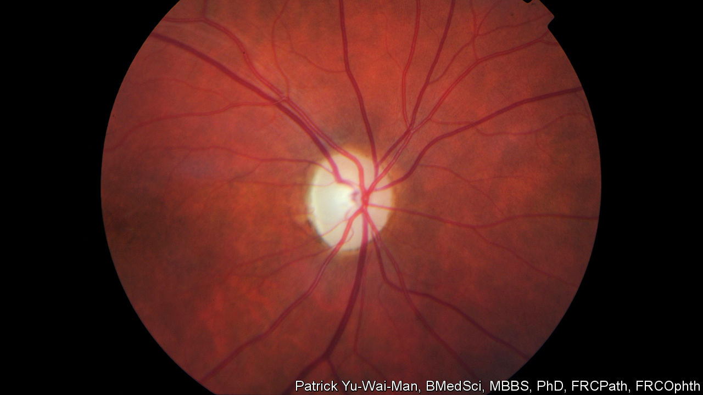

###### Gene therapy

# A failed study shows a promising treatment for blindness 

##### A story of gene therapy and happy accidents 

 

> Dec 12th 2020 


IN THE TEXTBOOKS, science is simple. You come up with an idea, put it to the test, and then accept it or reject it depending on what your experiments reveal. In the real world, though, things are rarely that straightforward, as a paper just published in Science Translational Medicine shows. In it, a group of researchers led by Patrick Yu-Wai-Man, an ophthalmologist at Cambridge University, investigated a promising new genetic therapy for a hereditary form of blindness. Officially, their study was a failure, for their experiment did not show what the researchers hoped it would. But it was also a smashing success, for 29 of the 37 participants reported big improvements in their vision.


The disease in question is Leber hereditary optic neuropathy (LHON). A defective gene in a sufferer’s mitochondria—the tiny structures that provide a cell’s energy—causes retinal cells to die. That leads to sudden and rapid loss of sight, with many sufferers becoming legally blind within a year. It affects between one in 30,000 and one in 50,000 people. Men in their 20s and 30s are particularly susceptible. Treatment is limited and not particularly effective.


Since most cases are caused by a mutation in a single gene, LHON is a good candidate for gene therapy, a form of genetic engineering which aims to replace the defective gene with a working one. With that in mind, Dr Yu-Wai-Man and his colleagues loaded up a modified virus with a corrected copy of the gene and injected it into their patients’ eyes.


Many viruses can insert their genes into the DNA of their hosts. Ordinarily, that is a bad thing, because cells so subverted churn out more copies of the virus. In this case, the hope was that infection would be a good thing. The defanged virus could not reproduce. But it was capable of replacing the damaged gene with a working copy.


Most medical studies make use of a control group, against which the effectiveness of the treatment can be measured. Here, the researchers controlled the experiment by injecting only one of each patient’s eyes—chosen at random—with the virus. The other eye was given a sham injection, in which a syringe was pressed against the eye, but nothing came out of it. Using two eyes in the same patient makes for a perfect control: their genetic make-up is identical, and any confounding lifestyle factors are removed from the equation.

Cross-eyes


The surprise came several months into the study. The researchers had hoped to see a big improvement in the treated eyes, compared with the untreated ones. They did not, and for that reason the study failed in its primary objective. Instead, in more than three-quarters of their patients, they saw substantial improvements in both eyes.


On the face of it, that was bizarre. Only one eye had received the treatment, after all. Follow-up studies in monkeys confirmed what the researchers had suspected. The virus, it seems, had found a way to travel from one eye to the other, probably via the optic nerve. Tissue and fluid samples from monkeys given the same treatment as the human patients showed viral DNA in both eyes, not just one.


Although it had a happy outcome in this case, the prospect of a gene-therapy virus travelling to places it is not intended to go might worry regulators. Fortunately, the researchers found no trace of the virus elsewhere in the monkeys’ bodies, including the visual cortices of their brains. And, though the study was technically a flop, its practical success means that an effective treatment for LHON may at last be in reach. GenSight Biologics, the company that has developed the treatment, has already sent its results to Europe’s medical regulator. It hopes to hear back by the end of 2021. ■

