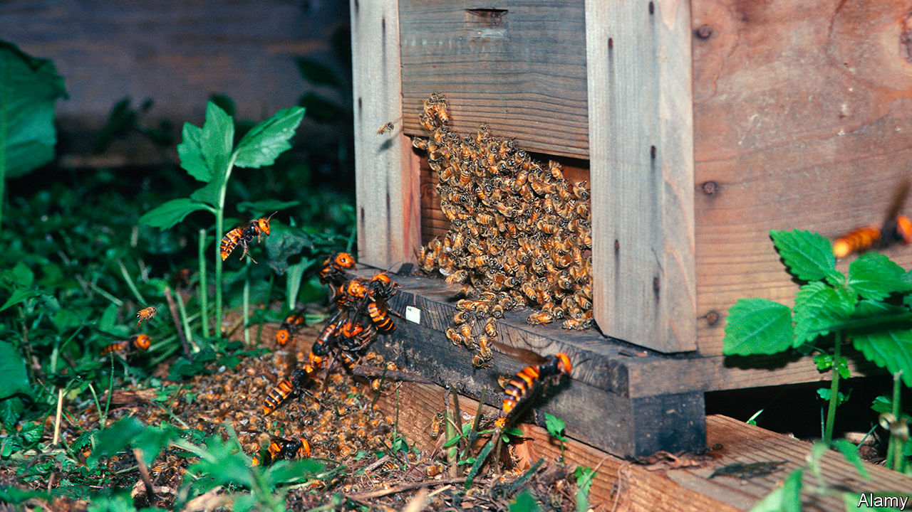

###### Bees versus hornets

# Bees defend their hives against hornets with animal dung 

##### They seem to be engaging in a form of chemical warfare 

 

> Dec 12th 2020 


HONEYBEES IN ASIA have it rough. Unlike their cousins in North America, where bee-eating hornets have arrived only recently, Asian bees are relentlessly hunted by these giant wasps. Constant attacks have kicked Asian honeybee evolution into high gear and resulted in the insects developing several defensive tactics besides simply using their stings. First, Asian honeybees build their nests as fortresses, with tiny entrances and tough walls. They also hiss aggressively at predators, to warn them they are being monitored. And, if that doesn’t work, they can swamp attackers in “bee balls”, which generate such heat that hornets inside are cooked alive. Now, a study published in PLOS ONE, by Heather Mattila of Wellesley College, in Massachusetts, shows that these bees have yet another trick up their sleeves: they shield their homes with dung.


Vespa mandarinia and Vespa soror are known as murder hornets for a reason. When scouts from these species find a honeybee hive they land and leave chemical markers near the entrance. The scouts then return with up to 50 of their kin to launch an attack. Armed with powerful jaws and tough body-armour that makes them resistant to bee stings, the hornets besiege the hive’s entrance and try to tear it apart so that they can force their way in. They are attacked by guard bees as they do so, and are sometimes successfully driven away. But not always. Often, they get inside and, once there, each hornet kills thousands of bees. This slaughter paves the way for the hornets to gather the real target of the attack, the brood of larvae developing in the hive. These, they carry away to feed to their own young waiting back at the nest. That obliterates the hive.


Hornet attacks are devastating to apiculture, so there is great interest from bee-keepers in finding ways to help their charges keep these predators at bay. When Dr Mattila’s co-author Gard Otis, of the University of Guelph, in Canada, learned from a beekeeper in Vietnam that bees there stick globs of water-buffalo dung on their hives after being visited by hornets, it therefore piqued his curiosity.


That, in turn, led Dr Otis, Dr Mattila and their colleagues to visit Vietnam, where they monitored 339 honeybee hives. They discovered that many of these hives were indeed covered in globs of what looked like manure, and that most of these globs were clustered around the hive entrance. When they monitored bees’ movements they discovered not only that the bees were collecting buffalo dung, but also that they regularly created globs from faeces collected at a chicken coop and a dung pile in a pig enclosure. Further monitoring of the hives showed that the bees quickly attached hundreds of globs of faeces to their hives after hornet attacks.

Off the mark


To see whether this was a consequence of the chemical marks, Dr Mattila and her colleagues collected extracts from the glands hornets use to secrete the substances involved. They then soaked some filter papers in these extracts and put bits of this material near hive entrances. As a control, they also soaked some filter papers in ether, and distributed those likewise near the entrances of other hives.


The hornet extract provoked a strong response. Within a day of its arrival hive members created an average of 15 nearby globs. The ether prompted an average of only two. This suggests bees are indeed wise to the marking tactics of hornets, and prepare for a potential attack accordingly.


To make sure the globs actually do help bees defend their hives, the team recorded some attacks. A well-globbed-up hive, they found, reduced the amount of time hornets spent trying to break in by 94%.


Why globs of faeces repel hornets remains a puzzle. Dr Mattila speculates that dung contains compounds which antagonise the hornets in some way. Specifically, these would be defensive substances synthesised by the plants that buffalo, pigs and chickens eat. If that idea does indeed turn out to be correct, then it seems Asian honeybees have invented an effective form of chemical warfare.■

