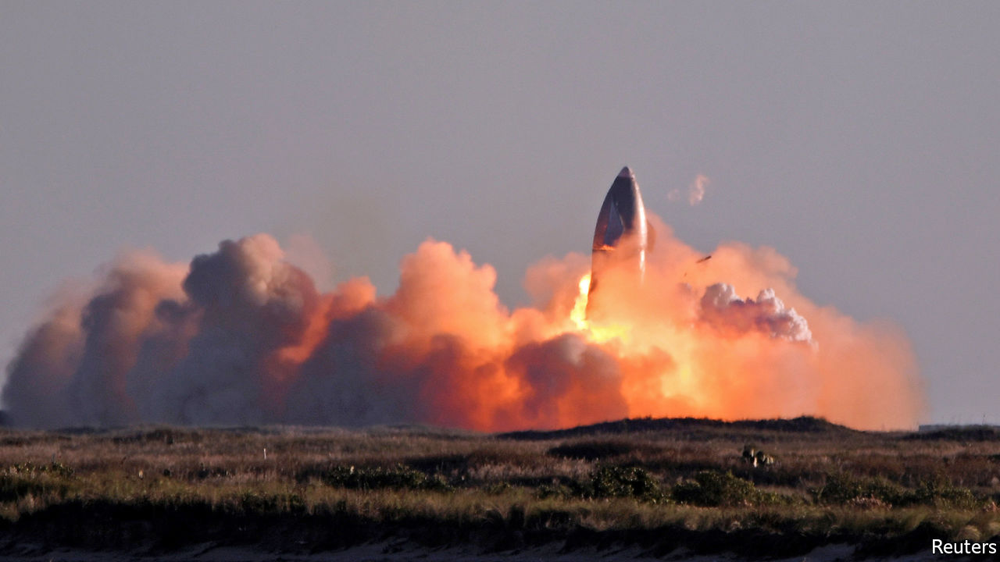

###### SpaceX

# Elon Musk’s latest rocket launch is a successful failure 

##### It crashed. But the data collected will help improve the next attempt 

 

> Dec 10th 2020 


"FAILURE is an option here. If you are not failing, you are not innovating.” So said Elon Musk a few years after he had set up SpaceX, his private rocketry firm. And fail, at the end, his most recent test did. On December 9th SN8, the latest incarnation of SpaceX’s Starship, a craft intended as the second stage of a rocket that will be able to carry 100 tonnes of payload, people included, into orbit, and thence to the Moon and Mars, took off perfectly from its pad in Boca Chica, Texas. It rose to an altitude of 12.5km, cut its three engines and manoeuvred itself parallel with the ground to fall back to Earth. Just before touch down it restarted its engines and lifted itself upright to land. But it came in too fast, and the result can be seen above. Nothing daunted, Mr Musk said that the flight had provided “all the data we needed” before its RUD. For those not in the know, RUD is SpaceX jargon for “Rapid Unscheduled Disassembly”.■

