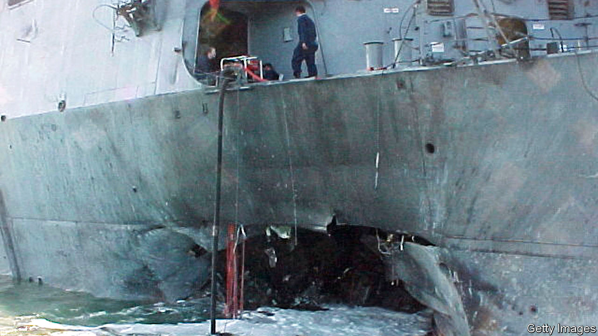

###### A megamegaphone

# Super-loudhailers are becoming louder still 

##### That is good for warfare. Perhaps less good for civilians 

 

> Dec 12th 2020 


YOU NEED a pretty powerful bullhorn to broadcast a message to someone who is 2km away. But that is what America’s navy is currently looking for. It wants, among other things, to be able to warn the crews of small vessels, who may or may not be hostile, not to come too close to its ships. And, if the warning is ignored, it would like to be able to hit them with a noise so piercing and horrible that even a determined attacker would have difficulty ignoring it and carrying on regardless.


To some extent, it can do this already. After USS Cole, a guided-missile destroyer, was attacked successfully by boat-borne suicide-bombers in 2000, ripping a huge hole in the vessel’s side (see picture) and killing 17 sailors, America’s admirals have been understandably nervous about the proximity of such craft. One consequence of that nervousness is that they have acquired so-called Long Range Acoustic Devices (LRADs) to hail possible threats. The current top of the range, the 2000RX, generates 160 decibels, while a portable cousin, the 100X, manages 137. But the navy now wants something that combines the former’s power with the latter’s convenience, and with a higher fidelity of transmission.


Now hear this


The upshot of that desire is a project called Focused Enhanced Acoustic-Driver Technologies (FEAT) for Long Range Non-Lethal Hail and Warn Capabilities. This will build on a previous effort, the Distributed Sound and Light Array (DSLA), that used eight large loudspeakers. FEAT, if the plans work, will be more compact.


Existing LRADs use piezoelectric elements to generate their sound. FEAT, by contrast, will be similar to a conventional loudspeaker—employing a moving magnet to vibrate a diaphragm or cone. This arrangement works better at low frequencies than piezoelectric sound generation, which is important if voices are to be projected, for lower frequencies make speech easier to understand. They are also better at penetrating buildings and vehicles, to deliver messages to those inside.


Louder loudspeakers, though, require stronger magnets and tougher materials. For the magnets, this may mean a better version of the neodymium devices currently favoured by the speaker industry, or possibly some more exotic material. For the diaphragms, the navy’s engineers may be looking at graphene, or possibly synthetic diamond. These allotropes of carbon are both much stronger than conventional speaker materials.


FEAT will combine the outputs of several drivers (the vibrating units that convert an electrical signal into sound), using a technique called beamforming to focus them onto a distant target to create a total volume of more than 156 decibels. Beamforming is widely employed in radio antennae, and the DSLA showed that it is equally effective for sound waves. Lastly, and perhaps most ambitiously, FEAT will include technology intended to cancel atmospheric distortion. This approach improves the focus of laser beams, but has not yet been demonstrated to work for a beam of sound.


The navy is now selecting contractors for a nine-month feasibility study. If that works, the second stage will be to build a prototype for testing by the marine corps. Once deployed, the technology will also be shared with the Departments of Justice, Homeland Security and others. This will not be music to everyone’s ears, though, for LRADs, which are used by some police forces as well as the armed services, are already controversial.


Six people, for example, are suing the New York Police Department for excessive use of force after being exposed to an LRAD in 2014. They allege lasting damage, including tinnitus and migraines. In 2019 a federal appeal court took the plaintiffs’ side and the case continues. And the American Speech-Language-Hearing Association, a group of doctors who work in the area, warns that LRADs could cause permanent hearing loss and balance problems, and advises protesters who might encounter them to wear hearing protection. In June, the mayor of Portland, Oregon, ordered police not to use the “warning tone” function against protesters.


More powerful sonic devices could save lives by conveying warnings to people in small boats or vehicles approaching checkpoints before they behave, possibly mistakenly, in a way that risks their being fired on. They could also warn occupants of buildings about to be cleared by force, giving bystanders a chance to escape before the shooting starts, and enemy combatants the option to surrender. However, smaller, cheaper devices may prove more prone to misuse than LRADs. And if this new technology spills over into the commercial sector, noisy neighbours could wage their own kind of sonic warfare.■

