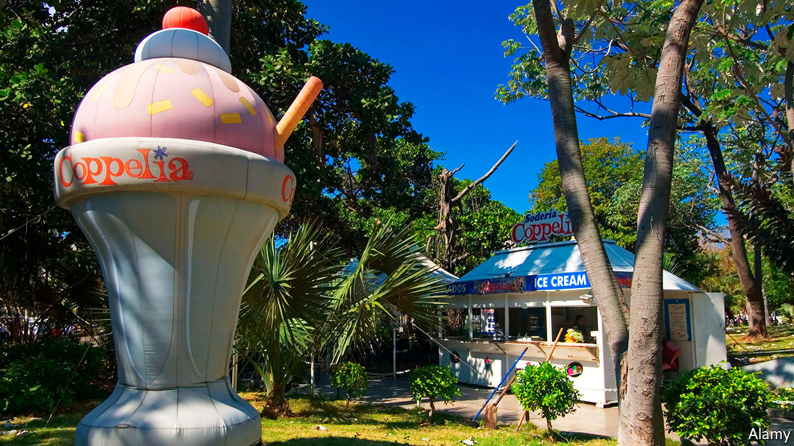

###### Udder delight

# Cuba extends the shelf life of a national favourite, dulce de leche 

##### A rare success in a decades-long quest for more and better dairy products 

 

> Dec 10th 2020 


CUBANS LOVE dulce de leche. The confection of thickened, sweetened milk is an ingredient of popular desserts, including tarta de tres leches (three-milk cake) and alfajores. In a country where fresh milk is scarce, it is sold in the form of solid bars, a sugary way to get a bit of milk protein.


But the bars do not stand up well to Cuba’s heat and humidity. Mould and yeast spot them, often well before the sell-by date. So it was cause for excitement when Adriana Rodríguez, a student of chemical biology, reported in her master’s thesis that she had solved the spoilage problem. Her research was prompted by complaints from shoppers at stores supplied by Granlac, a state-run dairy firm, which employs her. After two years of experimenting she concluded that the admixture of potassium sorbate, a common preservative, as 0.11% of the product’s weight would increase its shelf life from a promised seven days to 30. The new recipe also made the bars harder, and therefore less prone to crumble. La Demajagua, a state-run newspaper, broke the news in November and other newspapers followed. Production of long-life dulce de leche is on its way.


This is a rare success in a long and mostly thwarted quest to satisfy Cubans’ craving for dairy foods. In a speech in 2007 Raúl Castro, then the country’s president, declared: “We must produce enough milk so that any Cuban who wishes to drink a glass of it can.” His brother, Fidel Castro, the founder of Cuba’s revolution, loved ice cream almost as much as cigars. In a foreword to a book based on interviews with Fidel, Gabriel García Márquez recounts a Sunday afternoon during which, after a large lunch, the leader gobbled 18 scoops. He also liked to quaff chocolate milkshakes at the Havana Libre hotel. In 1963 the CIA took advantage of this weakness by attempting to poison one. The plot failed because the pill to be slipped into Castro’s shake froze to the wall of the hotel’s freezer.


Undaunted, Fidel made dairy goods a symbol of the revolution. He wanted to prove that Cuba could churn ice cream as well as the Americans, and outdo the French in making Camembert. In the 1960s Coppelia, a sprawling outdoor ice-cream parlour in downtown Havana, served 50 flavours to 35,000 customers a day.


But the island’s Creole and Zebu cows were lacklustre lactators. Fidel ordered the import of Holsteins from Canada, but many perished in Cuba’s heat. Government breeders tried mating Holsteins with Zebus, hoping to create hardy milk cows. Just one of their offspring lived up to Fidel’s hopes. Ubre Blanca (“White Udder”) set Guinness world records for daily and seasonal milk production. When she was slaughtered in 1985, aged 13, Granma, the Communist Party’s newspaper, published a full-page obituary.


Dairy disaster deepened in 1990, after the former East Germany halted food shipments to the island and the Soviet Union cut back on deliveries of butter. Fidel famously chose to produce ice cream rather than butter, perhaps thinking it would bring relief to sweltering Cubans.


Things have not improved much. In October this year Marino Murillo Jorge, the economy and planning minister, said Cuba could import milk more cheaply than it could produce it. But since foreign currency is scarce, so is milk. Coppelia serves fewer flavours: vanilla, coffee, coconut and tiramisu, recalls a recent visitor. The only Cubans who can count on a daily glass of milk are those younger than seven, who get a serving through the ration-book system. For sweet-toothed adults there’s dulce de leche, soon minus the mould. ■

