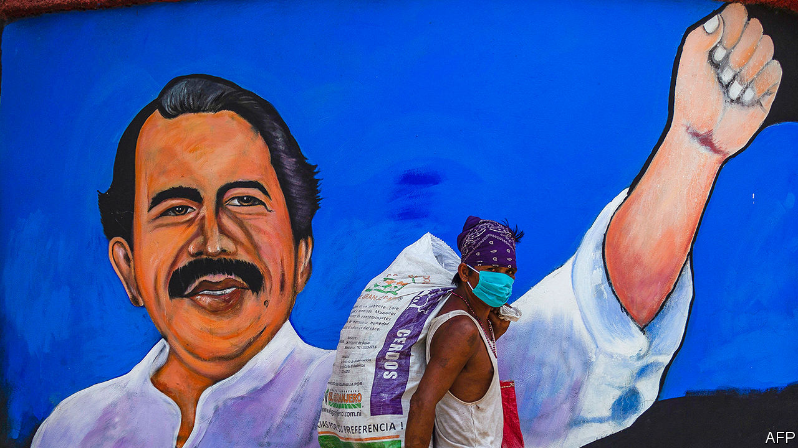

###### Seeing off a strongman

# How to unseat Nicaragua’s Daniel Ortega 

##### To have any chance in next year’s presidential election, the opposition must unite now 

 

> Dec 10th 2020 


CLOAKED IN A hoodie, Camila found herself bellowing anti-government slogans along with scores of other people at a crossroads in Managua, Nicaragua’s capital, in April 2018. The protest was part of la crisis, which began in reaction to a proposal to cut pension benefits. In putting it down, the regime killed perhaps 450 people. Camila (not her real name) feared she would be spotted by government agents scanning the crowd. As repression mounted, she fled from Nicaragua. Neighbours, part of the regime’s network of local spies, later stopped by her family’s home to ask after her. Camila now studies in Europe. She will not go back, she says, until Daniel Ortega, the regime’s leader, is out of power.


Veterans of la crisis will have a chance to remove him in a presidential election scheduled for November 2021. In a fair vote Mr Ortega, who has held power without interruption since 2007, would probably lose it. But he has long stopped practising fairness. The opposition is energised and determined—but also divided. If it is to put up a respectable fight, it will have to settle its differences and find a leader soon.


John Bolton, a national security adviser under Donald Trump, branded Nicaragua’s regime and those of Cuba and Venezuela as a left-wing “troika of tyranny”. But Nicaragua is in some ways an exception. Mr Ortega’s revolutionary credentials are impeccable. His Sandinista Liberation Front overthrew the United States-backed Somoza dictatorship in 1979. He governed the country until he lost an election in 1990. But he is more an opportunist than an ideologue. During his second stint in power, even as Nicaragua took billions of dollars from Venezuela, he formed an alliance with business and wooed the Catholic church by supporting family values and anti-abortion legislation. Although the United States and the European Union imposed sanctions against officials and institutions after the crackdown in 2018, Nicaragua is not quite the pariah in the West that Venezuela is. The IMF agreed to lend it $185m to cope with the pandemic.


Mr Ortega’s friends let him rig elections and take control of courts, the electoral authority and the media. He governs with Rosario Murillo, who is both first lady and vice-president. The duo delivered political stability. Economic growth helped pay for benefits, such as tin roofs, for the poor.


But when aid from Venezuela dried up the government had to make painful reforms, including the pension cuts that sparked la crisis. The unrest hurt business confidence and tourism, causing the economy to shrink by a seventh since 2017. The number of formal jobs had fallen by a fifth, even before the pandemic struck.


When it did, the Ortega government was complacent. Before Nicaragua had confirmed cases, Ms Murillo held a rally for “love in the time of covid-19” to show solidarity with less fortunate countries. Nicaragua responded to the pandemic’s onset with the world’s laxest containment measures, according to a stringency index put together by Oxford University. The death toll, officially 162, is 6,000-7,500, according to an analysis by Confidencial, a newspaper, of extra deaths attributed to diabetes, pneumonia and heart attacks. Two hurricanes that struck in November left thousands of Nicaraguans homeless (see ).


Mr Ortega’s popularity has plummeted. His odds of re-election depend on the coherence of the opposition, and how much he is willing and able to undermine the integrity of the vote.


The opposition that burst into life in 2018 lacked leaders and organisation. Those emerged when Mr Ortega convened a dialogue as a way to buy time. Students, businessfolk and think-tankers founded the Civic Alliance. A peasants’ movement, formed earlier in the decade, took part in the dialogue. Blue and White National Unity (UNAB), a grouping of more than 100 student and civil-society outfits, sprang up after the talks.


These groups all want to restore democracy and obtain justice for the victims of the crackdown. They are not natural partners. UNAB worries about inequality. “We see crony capitalism as part of the problem,” says UNAB’s leader, Félix Maradiaga. The Civic Alliance prioritises a quick economic rebound. Mistrust within the opposition is rife, partly because almost everyone has at some point dealt with Mr Ortega.


In January its separate elements joined to form a National Coalition. The Civic Alliance left nine months later, angry that a party in the coalition had come under the regime’s sway. (It now has new leaders.)


To have any hope in November’s election the opposition will need to unite. A candidate needs only a plurality to win. In an opinion poll in June, no opposition figure was mentioned as the probable winner by more than 13% of respondents. “We lack a messiah,” says Juan Sebastián Chamorro, the head of the Civic Alliance. The opposition has until June to register a candidate as the nominee of a party (perhaps the small independent Citizens for Liberty).


Contenders include Mr Maradiaga, Mr Chamorro and Medardo Mairena, the peasants’ leader. It is not clear how the choice will be made. In a stalemate Cristiana Chamorro, Mr Chamorro’s cousin and the daughter of Violeta Chamorro, who succeeded Mr Ortega in 1990, could become the opposition’s standard bearer. Managua’s magnates would back her.


Mr Ortega is already harassing his would-be opponents. Mr Maradiaga says he has lost three drivers in three months because the police confiscated their licences. Last year Mr Mairena was convicted of attempting to overthrow the government and sentenced to 216 years in prison, where he was tortured. He was eventually pardoned. Mr Ortega may not allow any credible candidate to challenge him.


The government has recently enacted laws that would mete out prison sentences for spreading “fake news” (as the regime defines it) and brand as “foreign agents” NGOs that get money from abroad. Under a new law, perpetrators of “hate crimes” can be jailed for life. Opposition politicians fear it will be used against them.


But Mr Ortega is reluctant to steal elections as flagrantly as his friend, Nicolás Maduro, who on December 6th arranged for Venezuela’s ruling party to wrest control of the legislature from the opposition. Without Venezuela’s largesse and oil reserves of its own, Nicaragua has turned to Western financial institutions. The IMF loan is part of nearly $1bn in credits for coping with the pandemic and hurricane damage. (At the insistence of the United States, the UN and other bodies will administer most of that money.) Brazen electoral fraud would invite tough sanctions from the incoming Biden administration. Full pariah status would further alienate the tycoons who run much of the economy.


For these reasons Mr Ortega may offer olive branches. They could include the release of the 100-odd remaining political prisoners and electoral reform. The crafty president will need to strike the right balance. Too little fairness may provoke isolation and another uprising. Too much may lead to his defeat. The opposition hopes to exploit any miscalculation.


It must overcome voters’ scepticism as well as Mr Ortega’s manoeuvring. The opposition “represent their own interest”, says Camila, the hooded protester. Unity might help correct that impression. It will be needed, even if Mr Ortega, who is 75, wins. Nicaragua will still require a robust opposition as a bridge to the eventual return of democracy.


Democracy alone may not heal Nicaragua’s wounds. When Camila contemplates returning, she wonders: “How do I live with my neighbour who came down to look for me?”■

