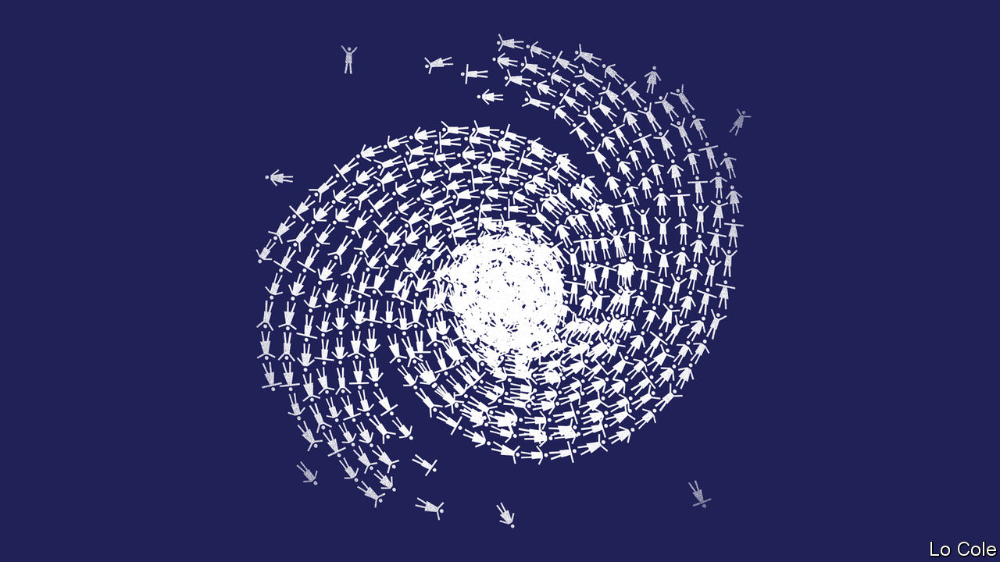

###### Bello

# Natural and political disasters in Central America 

##### Hurricane damage will cause problems for Joe Biden, too 

 

> Dec 12th 2020 


IT IS A month since Central America was hit in quick succession by two hurricanes. Parts of northern Honduras are still under water: 50 bridges are down, and 120 roads and many hospitals and schools are still flooded. In all, some 200 people died and 7m were affected by the storms, most of them in Honduras and Guatemala, according to the UN. Tens of thousands of homes were destroyed, and perhaps 175,000 people are living in makeshift shelters.


The hurricanes came at a bad time, amid the pandemic and its economic slump. Whereas in Guatemala and Nicaragua they struck rural areas, in Honduras they devastated the Sula valley, the country’s economic heartland. The Honduran economy was already set to shrink by 7%, and unemployment had soared. Honduras, a country of 10m people, “is now facing the greatest catastrophe in its history”, says Gina Kawas, a consultant at the Central American Bank for Economic Integration who is based in Tegucigalpa, the capital. Total damage is equivalent to 40% of GDP.


With livelihoods destroyed, the flow of migrants to the United States is likely to increase. So think the presidents of Honduras, Juan Orlando Hernández, and Guatemala, Alejandro Giammattei. Both have cited the likelihood of increased migration when calling for North American help. “If we don’t want to see hordes of Central Americans looking to go to countries with a better quality of life, we have to create walls of prosperity in Central America,” said Mr Giammattei.


This is realistic—and an implicit threat. Honduras and Guatemala are among the worst-governed countries in Latin America. They offer a caricature of the region’s ills, of poverty, inequality, racism, corruption and the capture of the state by self-serving elites. Government spending in both countries is the lowest per person in the region, after only Haiti. Guatemala had protests in November over Mr Giammattei’s budget, which cut education spending while lavishing money on insiders. Mr Hernández faced protests in 2017, when opponents accused him of fraudulently winning a second term.


Millions of Guatemalans and Hondurans have fled violence, poverty and climate change (which has hurt farming). Rather than raising taxes on the better-off to spend on health, education, security, disaster preparedness and climate-change mitigation, the rulers of both countries have preferred to rely on remittances from the leavers, which account for 22% of GDP in Honduras and 14% in Guatemala. Governments kicked out international bodies set up to tackle corruption and organised crime in both countries. Prosecutors in New York say Mr Hernández took a bribe from a drug-trafficker (he denies this). His brother was convicted of drug-trafficking by a court in New York in 2019.


Although a relief effort is under way in Honduras, it is “patchy”, says George Redman of Oxfam, a British charity. He points out that not only was the government unprepared—just weeks before the hurricanes it appointed a reggaeton singer with no relevant experience to head its disaster-relief organisation—but that the presence of street gangs complicates aid distribution.


Donors face a dilemma. The need is huge, but so is corruption. The former director of Invest-H, a supposedly corruption-proof agency that implements foreign-financed projects, is being investigated over misuse of foreign loans during the pandemic. Central America will thus be an immediate problem for Joe Biden’s administration in the United States. Arrivals at the southern border have risen since the covid-19 recession began. The new administration “will have to balance a desire for a more humanitarian approach [to immigration] with protecting the border”, says an American official who has worked on Central America. “It’s a challenge and it’s going to come quickly,” he says.


Mr Biden has promised a $4bn plan to deal with the root causes of migration from Central America. This builds on a scheme he promoted when he was vice-president. It aims to strengthen the rule of law and democratic governance, partly by helping local anti-corruption campaigners and prosecutors, who have had some success. The need for foreign help for reconstruction should offer leverage for reform. One idea is to set up an international body to work with local public auditors to track spending. But Honduras and Guatemala need political change, rather than just protest or individual efforts. Sadly, this is not on the horizon. That is a problem for the United States, as well as for the countries themselves.

