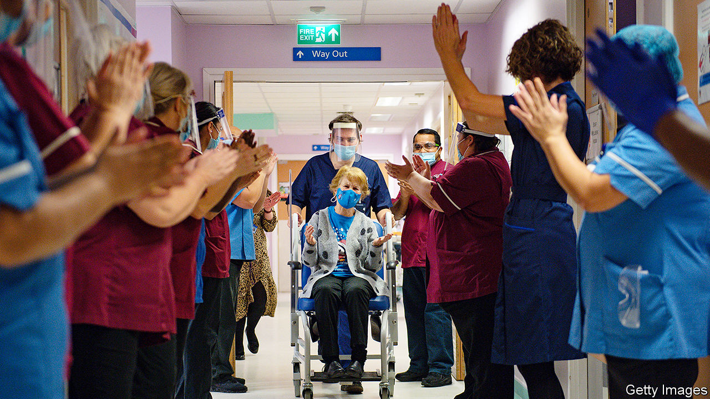
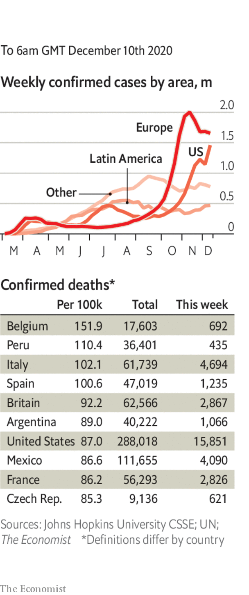

###### 

# Politics this week 

#####  

 

> Dec 10th 2020 


Britain began the world’s first vaccination programme for covid-19 using a fully tested vaccine. Thousands of people, mostly the very elderly and frontline health workers, received the Pfizer/BioNTech jab in hospitals. Family doctors will also administer the injections, as will care homes by Christmas. Canada became the second country to approve the Pfizer vaccine and will start distribution soon. In America regulators were on the verge of approving it.


General Lloyd Austin was tapped by Joe Biden to be his defence secretary. If confirmed, General Austin, who has led America’s command in Afghanistan and Iraq, will be the first black person to hold the job. He will also be a former military man in a position that by tradition goes to a civilian. Donald Trump’s first defence secretary, James Mattis, also came from the armed forces.


The House of Representatives passed a defence bill, with 140 Republican votes, that would, among other things, remove the names of Confederate generals that adorn some military bases. Mr Trump says he will reject the bill, but it has been approved by a two-thirds majority, enough support to override a presidential veto. It now goes to the Senate.


The House also passed a bill that would decriminalise marijuana and overturn the sentences of those who have been convicted of non-violent cannabis crimes. Its purpose is to redress the racial disparities in marijuana convictions (black people are more likely to be jailed for possession). It is unlikely to pass the Senate.


The Supreme Court made its first foray into the jumble of lawsuits from Republicans still trying to overturn the election result. In a one-line response with no dissents, it refused to hear a case from Pennsylvania. Joe Biden’s victory will be officially confirmed on December 14th, when the electoral college meets to cast its vote. See .


As Brexit trade talks went down to the wire, the British government announced an “agreement in principle” with the European Union over border controls between Ireland and Northern Ireland. Britain also agreed to scotch legislation that would allow it to break international law. Boris Johnson, the prime minister, went to Brussels for a dinner with Ursula von der Leyen, the president of the European Commission, but their meeting left a bad taste in the mouth for those hoping for a breakthrough. See .


France published details of a proposed new law designed to combat the spread of radical Islam. The law, which will go to parliament next year, was prompted by the beheading of a French schoolteacher for showing children cartoons of the Prophet Muhammad. See .


Venezuela’s dictatorial regime, led by Nicolás Maduro, reclaimed control of the legislature, the one branch of government it did not command. The ruling PSUV and its allies won more than two-thirds of the votes in a legislative election that was boycotted by most of the opposition. The PSUV’s victory means that the opposition’s leader, Juan Guaidó, recognised as Venezuela’s interim president by more than 50 countries, will lose his role as head of the assembly.


Tabaré Vázquez, who was twice Uruguay’s president, died. A doctor turned left-wing politician, Mr Vázquez’s victory in 2004 ended more than 160 years of rule by the National and Colorado parties. His second term ended in March this year.


Opposition candidates made gains in a parliamentary election in Kuwait, raising fears that they will stand in the way of efforts to tackle a fiscal crisis caused by low oil prices and the outbreak of covid-19. None of the 29 female candidates who ran won a seat.


Ethiopian federal troops fired at UN workers who were assessing roads to provide aid in Tigray, a war-torn region. Fighting erupted in November between the central government and Tigrayan forces, after Tigray held what the government called an illegal election. The government has shut internet and telephone access to the region. Thousands have died and perhaps 1m have fled their homes. 


Five people were killed in election-related violence in Ghana. Both presidential and parliamentary races were close. Results showed that Nana Akufo-Addo won a second term as president, narrowly beating his predecessor, John Mahama, who said the election was flawed. See . 


Opposition leaders in India complained that the government was preventing them from joining farmers protesting against recent agricultural reforms, which would curb price supports for crops. The protesters rejected an offer to revise the reforms.


Gibran Rakabuming Raka, the eldest son of Indonesia’s president, Joko Widodo, was elected mayor of the city of Surakarta, the job that launched his father’s career.


Rarely can a mountain stretch its advantage over its rivals, but this week Everest did just that. Nepal and China, the two countries that the “goddess mother of the world” straddles, agreed that the correct height is 8,848.86 metres above sea level, 86cm above the previous height, established in 1954 by a survey in India. China did its own estimate in 2005 and had insisted that Everest was four metres shorter.

Coronavirus briefs

 


America reported more than 3,000 deaths in a single day for the first time. Hospitalisations also hit a new record.


Most of California’s residents were told to stay at home, as tighter restrictions were introduced in counties where the virus is surging. 


Officials in France said it was now unlikely that a national lockdown will end on December 15th. In Germany, Angela Merkel said her country should go into a hard lockdown before Christmas.


Daily infections in India continued to fall, dropping below 27,000 for the first time in five months.


A “cruise to nowhere” in waters off Singapore, which allowed passengers to experience the fun of a cruise ship without disembarking, had to return to port when someone tested positive on board (he subsequently tested negative in a re-test).

