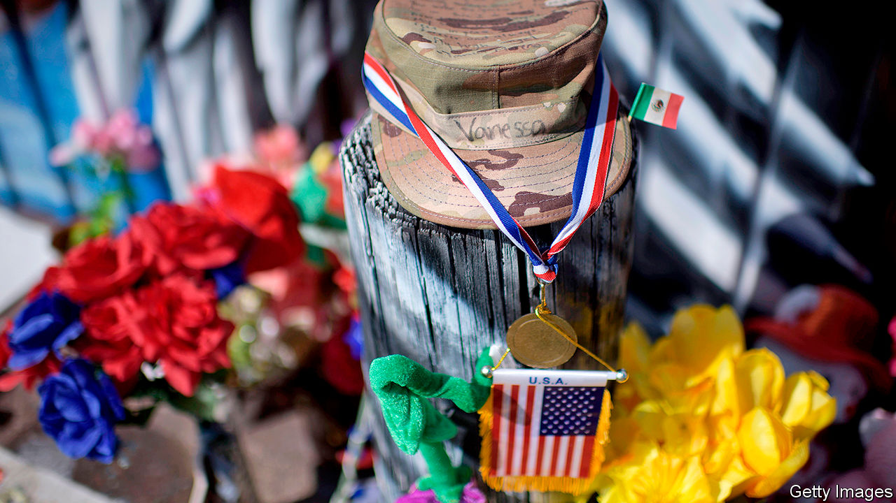

###### The Fort Hood report

# A scathing report on sexual abuse may alter army culture 

##### The US Army vows to change its ways in response to damning criticism on its failures at Fort Hood 

 

> Dec 10th 2020 


VANESSA GUILLéN, a 20-year-old soldier, told her mother she had been sexually harassed for months by higher-ranking soldiers at her Fort Hood army base in Texas. She had refrained from reporting it out of fear of retaliation. Not satisfied with the army’s response to her disappearance in April, her family told local lawmakers and media that she had been harassed by superiors. Two months after she went missing, her dismembered body was found buried near a river 20 miles from the base. It later emerged that one of the harassing soldiers allegedly murdered her.


The hashtag #IAmVanessaGuillén, a military version of #MeToo, went viral. Service members and veterans shared their stories of sexual harassment and assault in the army. President Donald Trump vowed to help the family. In recent years Fort Hood’s reputation has suffered as a result of sexual assaults, suicides, murders and two mass shootings as well as busts for prostitution and child-sex rings. Spurred by the outcry over Guillén’s death and public awareness of violence at the base, Ryan McCarthy, the army secretary, commissioned an independent review of Fort Hood’s leadership.


The mostly civilian panel released its scathing report on December 8th. It found that Fort Hood’s commanders fostered a “permissive environment”, which allowed sexual assault, harassment and violence to go unchecked. The panel called for staffing changes and better programmes to protect soldiers. In response, the army removed or suspended 14 military leaders, including the major-general who headed Fort Hood at the time of Guillén’s disappearance.


Fort Hood has much higher rates of violent sex crimes than other posts—75% higher than the army overall. As far back as 2014 the base was identified as a high-risk installation for sexual assault. The report said Fort Hood’s commanders did little to tackle the spectrum of criminal incidents. That led to underreporting of sex crimes. Like Guillén, victims feared retaliation as well as ostracism and career damage. Queta Rodriguez, a former marine who served on the committee, called the number of unreported sex crimes at Fort Hood “shocking”. The committee discovered 93 credible accounts of sexual assault among the 507 women it interviewed. Of those, only 59 were reported. Of the 217 accounts of sexual harassment, only half were reported.


The panel found an extremely high number of suicides, but because the post’s criminal investigators were inexperienced and under-resourced, contributing causes were not always examined. Fort Hood has the highest drug-test failure rate in the army. Local police describe the base as having a “thriving drug culture”, but little seems to have been done about it. The report also criticised the inadequate procedures for missing soldiers, especially when there are suspicious circumstances. The absent soldier is often labelled a deserter. More than two dozen soldiers have gone missing or died since the start of the year, including Gregory Morales, a murdered private who the army assumed went AWOL. His body was found near Fort Hood by investigators looking for Vanessa Guillén.


The panel made 70 recommendations. Nearly half are aimed at combating sexual harassment and assault. It also recommended new procedures for missing soldiers. In response, Mr McCarthy announced that the army would take immediate action when soldiers are reported missing and formed a task force to map out a plan to tackle the problems identified in the review. Although the report focused on Fort Hood, he said, its conclusions will have army-wide implications. He predicted that the findings “will cause the army to change our culture”.


Fort Hood’s dysfunction is not unique, says Don Christensen, the air force’s former chief prosecutor who heads Protect Our Defenders, an advocacy group. Sexual harassment and retaliation cut across all services, from small air-force bases to naval ships. “It takes a crisis to move the ball forward,” he says. Joe Biden, the president-elect, has said he would take a hard line against sexual abusers in the forces.


It is rare for the army to allow an independent review. Its findings are a wake-up call not just for the army, but for Congress, too, which has a history of being hesitant in pushing for change in the armed forces. Guillén’s family hopes Congress will pass the I Am Vanessa Guillén Act, which would allow outside investigators to handle military sexual misconduct. ■

