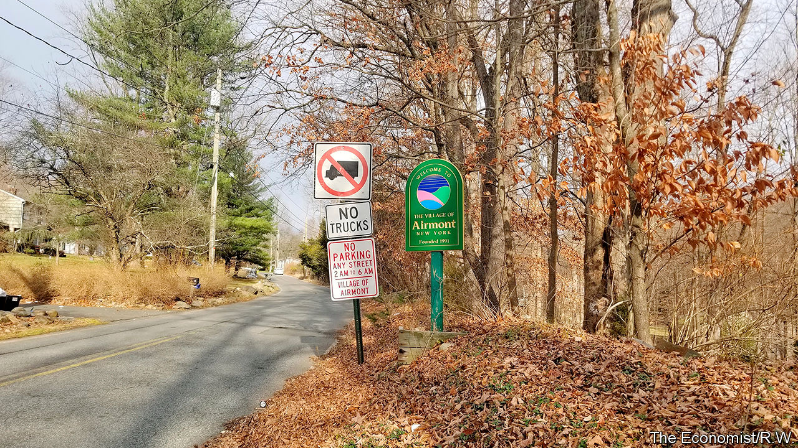

###### Religious discrimination

# Accusations of anti-Semitism return to a New York village 

##### Zoning in on zoning 

 

> Dec 10th 2020 


A  SUKKAH IS a temporary hut built for Sukkot, a weeklong Jewish festival. It is usually covered in branches. In September 2017 the then mayor of Airmont, a village 35 miles north of New York City, ordered the fire inspector to the home of the mayor’s neighbours, an Orthodox Jewish family, to demand the family dismantle its sukkah. According to a lawsuit filed by the federal government on December 2nd, the inspector, at the mayor’s direction, threatened the family with immediate eviction unless the sukkah was taken down. The family dismantled it, despite the sukkah not violating any law.


This is one of several examples of alleged religious discrimination offered by the Department of Justice in its lawsuit against Airmont. It asserts that the village adopted discriminatory zoning codes and land-use practices that violate federal law and previous court judgments. Airmont claims the government is misinterpreting the village code. Yet this is the third time the federal government has filed a suit against the village since it was incorporated in 1991. A jury unanimously found in 1995 that the village’s first mayor, trustees and zoning board had engaged in a conspiracy to deprive Orthodox Jewish residents of their civil rights. One local said at the time: “the only reason we formed this village is to keep those Jews…out of here.”


For much of its history, Airmont has been under investigation, in litigation or under some sort of federal oversight. Its very creation, said Audrey Strauss, the acting attorney for New York’s Southern District, has its roots in animus against Orthodox Jews. Its incorporation came about because some locals wished to impose zoning restrictions to prevent the growing ultra-Orthodox Jewish population from worshipping together at home.


Since federal oversight expired in 2015, the latest lawsuit says, the village has doubled down on discriminatory land-use zoning. The government claims the village unlawfully prevented the approval of an Orthodox Jewish school’s expansion. Airmont implemented an 18-month village-wide moratorium on development, which the lawsuit claims was targeted at the Orthodox Jewish community. When the moratorium expired in 2018, the filing claims land-use laws were amended and applied arbitrarily. Jewish homeowners were prohibited from installing mikvahs, ritual baths used for religious observances.


Several rabbis jointly filed suit in a federal court in 2018. The case is pending. Their lawyer, Keisha Russell of First Liberty, a not-for-profit firm that specialises in religious-discrimination cases, said one client spent $50,000 over two years trying to get approval for a home extension.


For the past decade the ultra-Orthodox (particularly the Hasidic) population has been growing in towns in upstate New York and neighbouring New Jersey. Many of the arrivals were priced out of their old neighbourhoods in gentrified Brooklyn. The surging numbers and their demands for land have often put them at odds with locals. After battles over zoning and lawsuits, voters in nearby Monroe agreed in 2017 to allow a Jewish enclave to secede from the surrounding town to create a new town called Palm Tree. There, most wanted to replicate city life, living close together in multifamily dwellings.


But most Orthodox Jews in Airmont live in single-family homes on large lots on quiet streets. Yehuda Zorger, a community activist, for instance, left Brooklyn in 2014 for Airmont’s suburban lifestyle. He says it has reached the point where even having extended family help fix his deck might draw the wrath of code enforcement. Had he known Airmont’s history before he moved there, he says, he would have looked elsewhere for his coveted suburban lifestyle. Now, he is not going anywhere. ■

