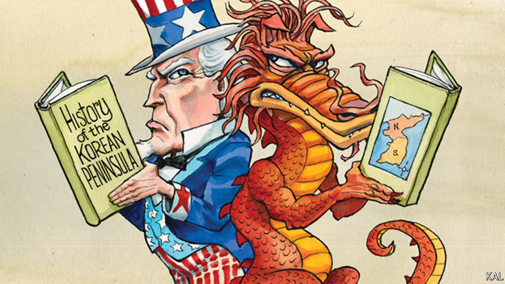

###### The battle of Chosin Reservoir

# Lessons from the battles between America and China, 70 years on 

##### When America and China went to war 

 

> Dec 10th 2020 


SEVENTY YEARS ago this month, Mao Zedong’s peasant army inflicted one of the worst military defeats on America in the country’s history. Over two weeks his “volunteer” fighters drove an army of 350,000 American soldiers and marines and their Korean allies the length of North Korea, from the Chinese border to hasty evacuations by land and sea. Though the Chinese suffered terrible casualties in the process and the war would continue for another three years (and technically has not ended), the American-led UN force never again threatened to reunify the peninsula.


This humiliation was made worse by the fact that General Douglas MacArthur, the force’s megalomaniacal supremo, had only weeks before assured Harry Truman that the Chinese would not cross the Yalu river. His commanders duly denied that they had. When that became incredible, they claimed the cruelly ill-equipped Chinese—wearing cotton uniforms and canvas shoes for a high-altitude war fought at minus 30°C—were not a serious foe. An American general called them “a bunch of laundrymen”.


It was classic superpower hubris, deserving of the contempt expressed by Xi Jinping at a grand 70th-anniversary event in October. Having emerged victorious from the second world war, with fewer casualties than any other major participant (America’s covid death-toll is almost equal to its second-world-war combat toll), America in 1950 had a dangerous sense of impregnability, a racially infused contempt for Asian capability and a few generals with absurdly inflated status, including MacArthur. It might seem little wonder that America, consumed by the contemporary embarrassment of its president’s effort to steal an election, is barely commemorating its first and only war with China.


That does not denote shame, however. Notwithstanding Americans’ dewy-eyed view of their forces, public knowledge of their victories and defeats is similarly thin. American schools do not teach much military history and democracies do not mobilise people through a militaristic view of the past. In the case of the Korean war, the first “limited” war of the nuclear age, before that concept was well-understood, the forgetting has merely been especially pronounced. Yet the war retains cautionary lessons for both sides.


On one level it encapsulated the superpower’s enduring ability to self-correct. This was apparent even amid the debacle—as illustrated by the battlefield recollections Lexington heard this week from Jack Luckett, a 91-year-old retired marine. He was occupying a ridge above Chosin Reservoir, close to the northernmost point of MacArthur’s advance, on the night of November 27th 1950. Awakened by explosions, he saw a column of Chinese—eight men across—advancing in the glow of the defensive flares they had triggered. “We were vastly outnumbered,” he said. “We opened fire but they kept on coming. They were blowing bugles and firing on us while pouring down both sides of the ridge.”


Mao’s intelligence chiefs had assured him that, for all their superior technology, American soldiers lacked the belly for a fight. The ensuing 17-day battle, which Mr Luckett fought through until frostbite laid him low, gave the lie to that. Surrounded by 120,000 Chinese, the 1st Marine Division broke out and made a heroic fighting retreat through the frozen mountains. The marines—and a small British contingent fighting alongside them—suffered terrible casualties; only 11 of Mr Luckett’s company of 250 survived unscathed. Yet they evacuated their wounded and equipment while inflicting a far heavier toll on the Chinese. Mr Luckett’s marine division was reckoned to have disabled seven Chinese ones.


For a military institution whose small size, relative to the US army, has fuelled a tradition of mythologising and introspection, “Frozen Chosin” ranks alongside “Iwo Jima” in importance. “It’s not an overstatement to say marines credit the marines who fought in Korea with ending the debate about whether there should be a marine corps,” says General Joseph Dunford, a former marine-corps commandant (and recently retired chairman of the joint chiefs of staff). His father celebrated his 20th birthday at Chosin reservoir on the day of the Chinese attack.


In the soul-searching that followed the American retreat, notes Max Hastings, a British historian, it is possible to see a familiar debate about the kind of superpower America should be. Deaf to the entreaties of allies, MacArthur refused to accept the limits to American power that his incompetence had helped display. He wanted to nuke the Chinese. Truman resisted and, after MacArthur sneakily appealed to his Republican backers in Congress, sacked the revered general. It may have cost him a second term. It also set a gold standard for civil-military relations that has since prevailed.


Truman’s multilateralism and restraint were also vindicated when his Republican successor, Dwight Eisenhower, maintained his conduct of the war. Better military leadership had by then stabilised the situation. America and China would both settle for their initial aims: respectively, securing South Korea, which would become one of the big successes of the late 20th century, and securing a Korean buffer against America’s presence in Asia. America lost 40,000 lives in the process; China maybe ten times as many.

First know your enemy


That Americans are not more interested in this momentous past ultimately reflects their restless democracy, which is too consumed by contemporary dramas to dwell on history. Current appearances notwithstanding, it is the source of American strength. Yet it is important to underline two lessons from America’s war with China. In a fog of misunderstanding, each side fatally underestimated the other. And each had a flawed idea of the other’s red lines, the tripwires that turn competition into conflict. The situation today might look very different. The two countries’ interdependence and mutual awareness are on another plane. But their potential for underestimation and misunderstanding is still hauntingly present; and perhaps growing with their rivalry.■

