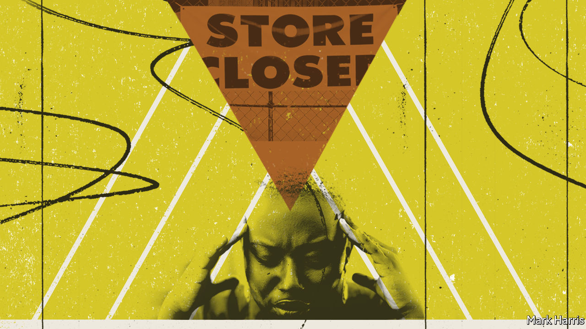

###### African-American businesses

# Serious help may be on the way for America’s black entrepreneurs 

##### Will banks and Biden start to level the playing field? 

 

> Dec 12th 2020 


BLACK ENTREPRENEURS face a mighty struggle. African-Americans make up about 13% of the country’s population but only 2% of its business-owners. Their firms earn just 0.3% of total business receipts. Minority-owned businesses are less profitable than comparable white-owned firms, and have much higher rates of failure.


The pandemic has hit these firms especially hard. Black-owned firms were nearly twice as likely to shut down (by August, over two-fifths had done so) because of covid-19 as small firms overall. Emergency aid often did not reach them, in part because the Small Business Administration (SBA) did not direct banks to prioritise lending to such firms as Congress intended.


Black entrepreneurs may now have two reasons for cheer. One is top-down. Past efforts by the federal government to boost minority enterprises, a mix of loan guarantees and quota schemes, have fallen short. A recent analysis by McKinsey, a consultancy, notes that although the SBA awarded some $2.3bn in federal contracts and backed about $210m in loans for disadvantaged businesses in 2019, these schemes were “often imperfectly implemented”.


The incoming administration is promising a big revamp. Joe Biden vows to fund such firms to retain and rehire workers. After the pandemic, he wants to expand training, small-business incubators and innovation hubs for “black and brown entrepreneurs”. He also promises to create a $30bn Small Business Opportunity Fund and to direct additional billions to minority firms.


But the playing field for black entrepreneurs is not level, argues Dana Peterson of the Conference Board, a business-research firm: access to credit is “too often determined by the colour of the skin”. Black households have just a tenth the assets of white ones. In addition, notes Katherine Klein of the Wharton School, they tend to have lower credit scores. Black female entrepreneurs receive less than 1% of all venture capital.


So even a tenfold increase in government funding would not solve the problem, argues Shelley Stewart of McKinsey, without bottom-up fixes too. That points to the second reason for cheer. In the wake of the Black Lives Matter protests, corporate titans have made big commitments to boost black businesses. JPMorgan Chase, a banking Goliath, says it will pour $30bn over five years into boosting black and Latino households and businesses. Citi, another giant bank, vows to take on “the racial wealth gap” with a $1bn pledge.


Sceptics worry this will prove mere “race-washing” and that Mr Biden’s efforts will get mired in red tape. But if they do take off, then black entrepreneurs might at last have a fighting chance. If they could achieve revenue parity with comparable white-owned businesses, McKinsey reckons, it would boost their business equity by $290bn.


Dig deeper:

Read our , and then sign up for Checks and Balance, our  and  on American politics.

